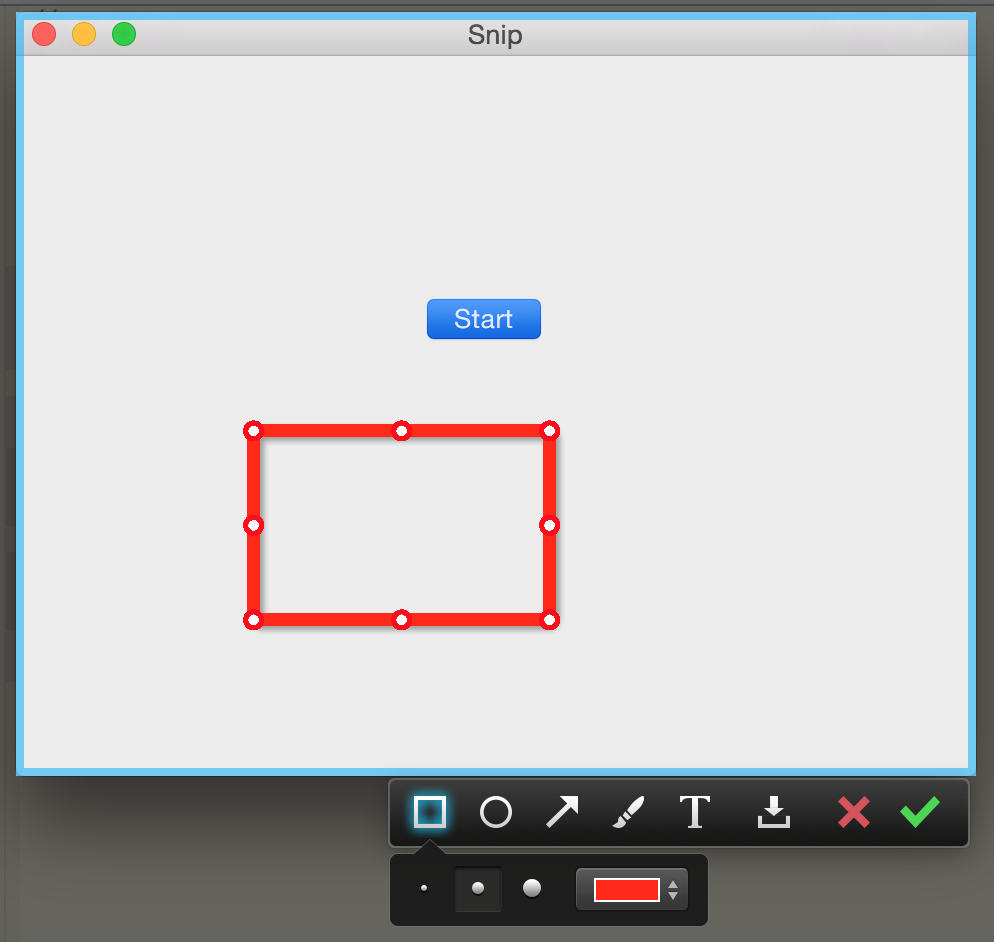

# QQ-capture-screen-on-mac
Mac QQ capture screen library,support dual monitors.
<br>
什么时候能开放给其他应用用，统一截图体验。
<br>
只能Demo用一下，体验一下QQ的强大。
<br>
最新版QQ和微信共用的JietuFramework
调用只需要
```
if (![[JTCaptureManager sharedInstance] isCapturing]) 
{         
[[JTCaptureManager sharedInstance] startCaptureByRequest:nil];     
}
```
然后hookcaptureDidFinishWithImage:needSave:isHighResolution: 方法获得截图图片
```
SwizzleSelectorWithBlock_Begin([[JTCaptureManager sharedInstance] class], @selector(captureDidFinishWithImage:needSave:isHighResolution:))
    ^(JTCaptureManager *oriSelf, id arg1,BOOL arg2,BOOL arg3) {
        ((BOOL (*)(id, SEL,id,BOOL,BOOL))_imp)(oriSelf, _cmd, arg1,arg2,arg3);
        NSLog(@"finishedCapture jt：%@",arg1);
        [self.imgView setImage:arg1];
    }
SwizzleSelectorWithBlock_End;
```
如果需要源码的简单实现，可以参考https://github.com/isee15/Capture-Screen-For-Multi-Screens-On-Mac
</img>
